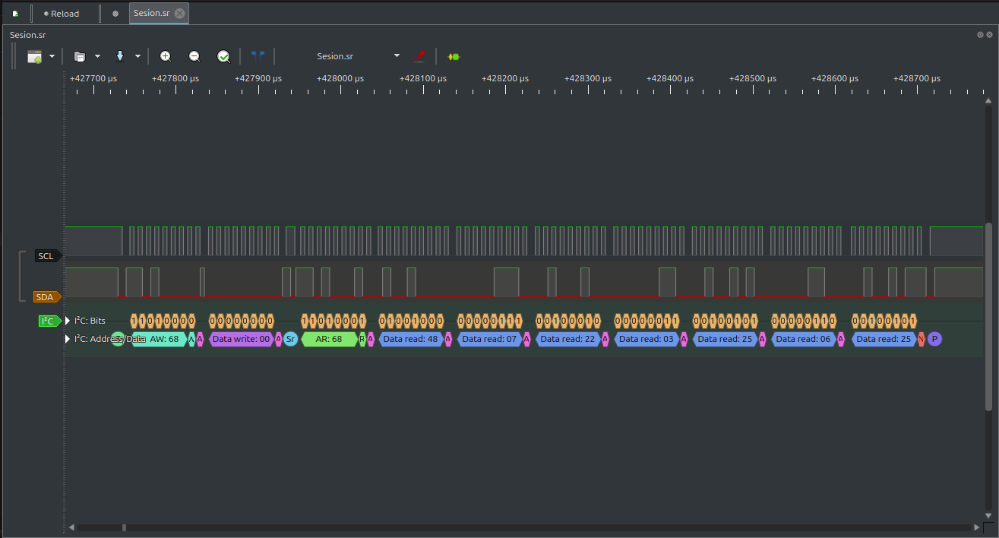
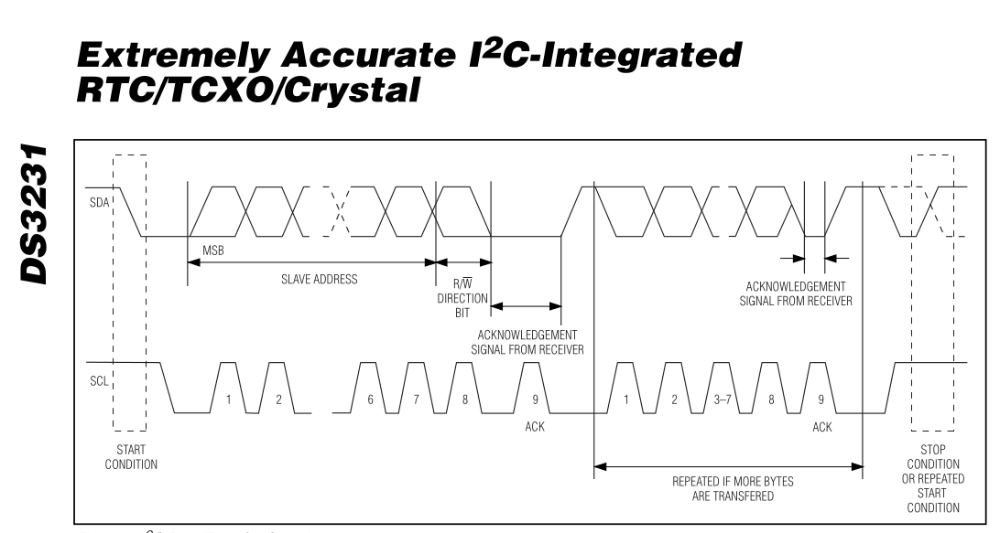
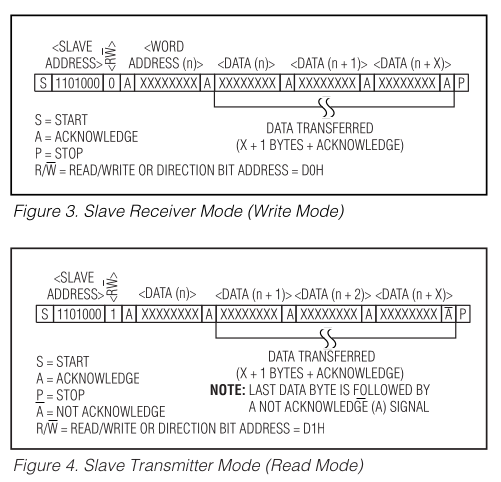

# RTC_Analisis

Esta carpeta contiene el desarrollo de los módulos necesarios para establecer la conexión entre la FPGA y el RTC DS3231.

## Tabla de contenido

1. [Metodología](#metodología)
2. [Módulos](#módulos)
   1. [`master`](#master)
   2. [`beg_com`](#beg_com)
   3. [`listen`](#listen)
   4. [`BCD`](#bcd)
   5. [`BCDtoSSeg`](#bcdtosseg)
3. [Videos de funcionamiento](#videos-de-funcionamiento)
4. [Notas adicionales](#notas-adicionales)

---

## Metodología

El primer paso para el desarrollo del proyecto fue su versión en Arduino, haciendo uso de está, por medio de un analizador lógico se pudo observar la secuencia completa de comunicación, e identificar lo que iba a ser necesario realizar con la FPGA para obtener respuesta del RTC

  
  
<em>Figura 1: Pulseview inicial</em>

<table align="center">
  <tr>
    <td align="center">
      
      
<em>Figura 2: I²C Data Transfer Overview <i>Datasheet</i></em>

    </td>
    <td align="center">
      
      
<em>Figura 3: I²C RW Mode <i>Datasheet</i></em>

    </td>
  </tr>
</table>

Usando como guía lo visto en *Pulseview* y la información del *Datasheet* correspondiente se comprendió por completo el protocolo. Entonces se crean los módulos **master** y **beg_com** para replicar esta secuencia. Una vez se confirmó la respuesta del RTC a las señales creadas por la FPGA nuevamente haciendo uso del analizador lógico, se buscó la forma de guardar esa información temporalmente para visualización y el control de alarma creando el módulo **listen**. Para poder confirmar el registro de la información se hace uso de los 7 Segmentos disponibles en la placa de desarrollo.

## Módulos

### `master`

Este módulo funciona como maestro del bus I²C, gestionando la secuencia completa de comunicación: desde el envío de condiciones de start/stop hasta la lectura/escritura de datos.

### `beg_com`

Este módulo se encarga de generar la condición de **inicio (Start)** del protocolo I²C cada 2 segundos para iniciar la comunicación adicionalmente la señal generada por este modulo va a ser de utilidad en el módulo **listen** pues sincroniza la captura de la información.

### `listen`

Responsable de recibir los bits desde el RTC por la línea `sda`, sincronizado con `scl`. Interpreta los datos leídos y detecta los bits de ACK/NACK.

### `BCD`

Este módulo convierte los datos binarios recibidos del RTC en formato **BCD (Binary Coded Decimal)** para facilitar su visualización y uso posterior teniendo en cuenta la condición de los 7 Segmentos de la placa, los cuales se encuentran multiplexados.

### `BCDtoSSeg`

Convierte los valores BCD en los códigos necesarios para controlar un **display de 7 segmentos**, permitiendo mostrar la hora de manera legible en hardware.

## Videos de funcionamiento

A continuación se incluyen enlaces a videos donde se muestra el sistema en funcionamiento:

- [Video 1 - Comunicación básica I²C, Respuesta RTC](Videos_e_imagenes/Jaspi_1.mp4)
- [Video 2 - Lectura y visualización de la hora](Videos_e_imagenes/Jaspi_2.mp4)

## Notas adicionales

- El diseño está escrito en Verilog.
- El sistema fue probado en una FPGA **[Intel Cyclone IV E: EP4CE10E22C8]**.
- El reloj externo usado es el **DS3231**, con alimentación de 3.3V.
- Se realizan pruebas en los 7 segmentos integrados en la tarjeta.
- Se anexan 2 archivos de pulseview `prueba_real_1.sr`y `Sesion.sr` los cuales fueron obtenidos con el analizador lógico y en ellos se puede observar la comunicación.
- Se anexa un testbench `tb_top.v` con el que se puede observar la comunicación simulada, sin embargo es necesario cambiar los parametros de **tiempo** y **Maxcount** en `beg_com` y `BCD` respectivamente para que se pueda observar en el tiempo de simulación.
- Se anexa el **Datasheet** del DS3231.
---

